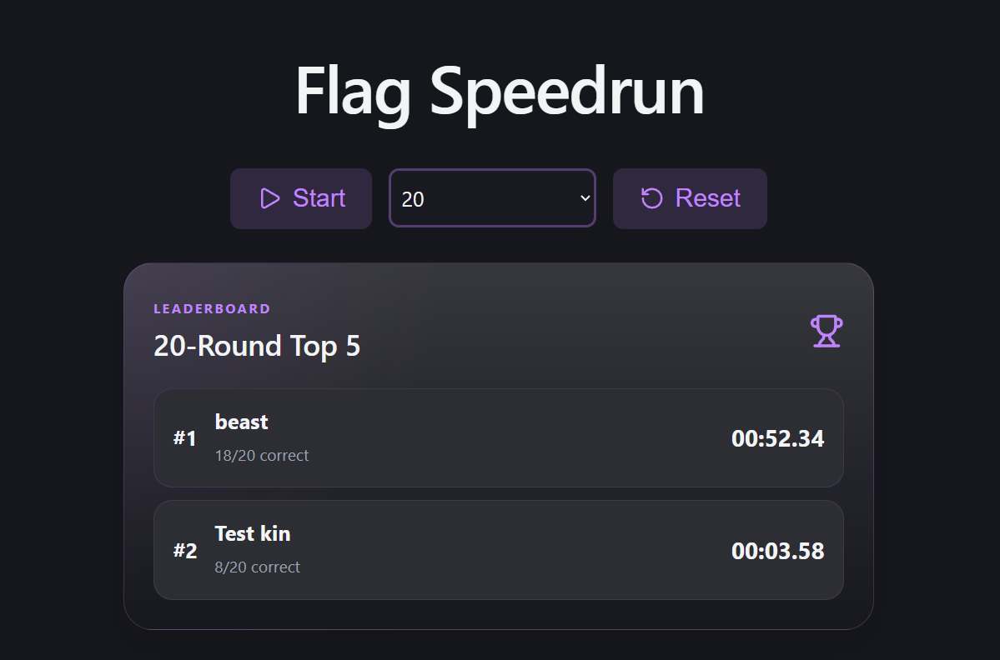
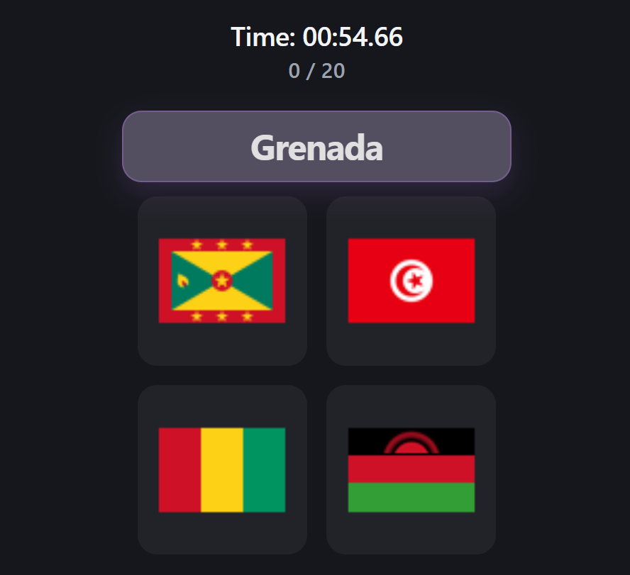

# Flag Speedrun

Flag Speedrun is a fast flag quiz game with a local leaderboard.

Players choose a round count, race through the flags, and submit their result with a username. The leaderboard ranks players by correct answers first, then time.

## Screenshots




## Usage

Install dependencies:

```bash
npm install
npm --prefix frontend install
```

Run the backend:

```bash
npm run start:backend
```

Run the frontend:

```bash
npm --prefix frontend run dev
```

Open:

```text
http://localhost:5173
```

## Local Network

Example:

```bash
CORS_ORIGIN=http://192.168.1.11:5173 npm run start:backend
npm --prefix frontend run dev -- --host 0.0.0.0
```

Then open:

```text
http://192.168.1.11:5173
```
